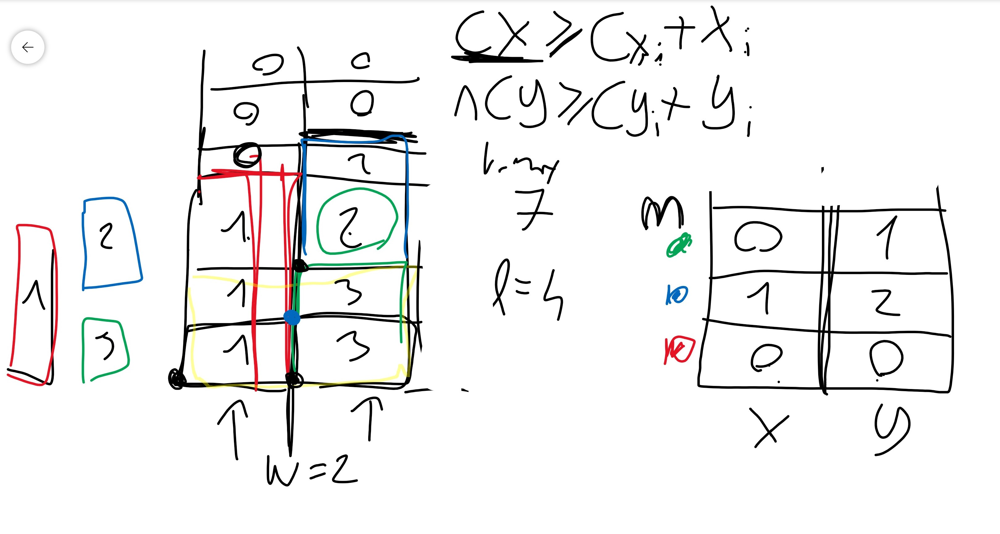
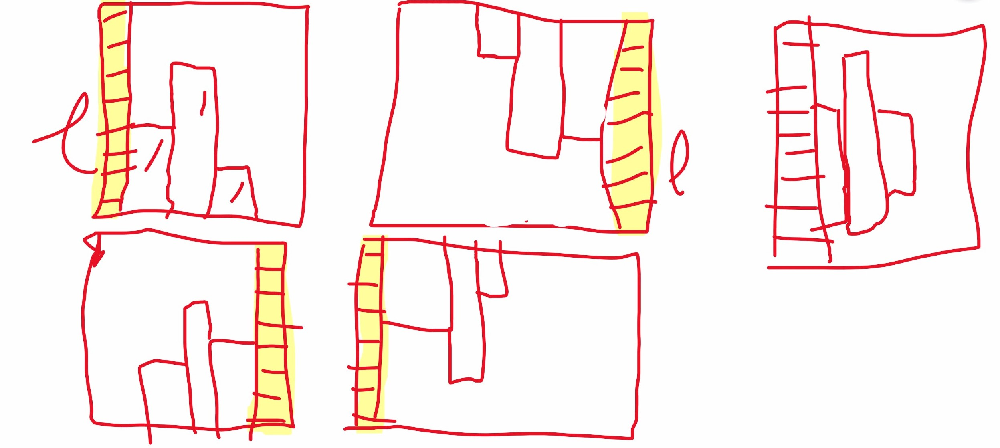
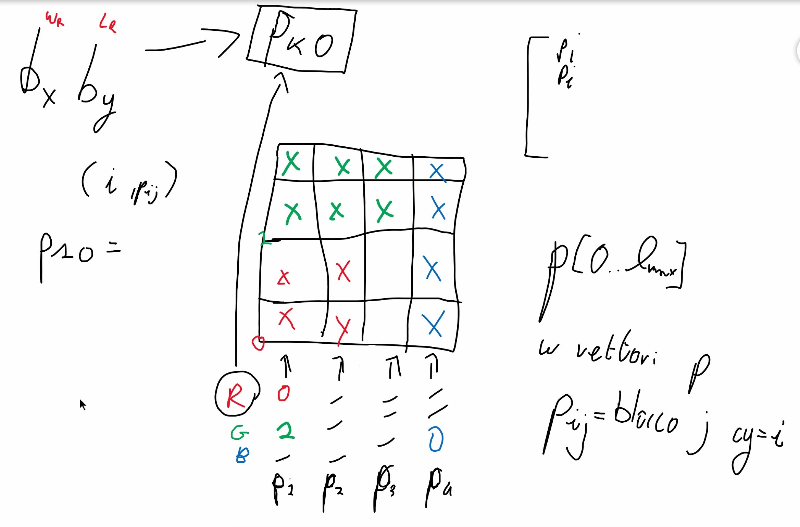

# PROJECT CDMO

We have to insert given circuits into a silicon plate.

Points:

- fixed width 
- fixed orientation of circuits
- number and dimensions of circuits are given 
- minimize length

**Instances example format**:

```
9 (w, width of silicon plate)
5 (n, number of necessary circuits to place)
3 3 (circuit 1, dimension x=3 - horizontal, y=3 - vertical)
2 4 
2 8 
3 9 
4 12
```

**Solution format**:

```
9 12 (w as before + l which is the minimal length of the plate)
5 (n, number of necessary circuits to place, as before)
3 3 4 0 (x, y as before + cx, cy which are coordinates of the left-bottom corner)
2 4 7 0
2 8 7 4
3 9 4 3
4 12 0 0
```


## First model

1. *Data*:

   - w
   - n
   - forall cirtuits: x, y
   - max_l (sum of all heights of circuits)

2. *Variables*: 

   - l (max of each column in the matrix that contains something)
   - p matrix of dimension n (numeber of circuits), 2 (x, y)
   - (altenative) p matrix of dimension w, max_l

3. Domains: 

   - p[x] in [0, w] and p[y] in [0, max_l]
   - (alternative) p in [0, n] (0 means empty, 1,2,3..., n represent the correspondent block)

   

4. *Constraints*: 

   - sum on any horizontal line traversed circuits can be at most w (implied constraint)
   - global constraints
   - symmetry braking constraints 
   - (ideas) set initially bigger blocks
   - forall circuits *cx + x <= w*

5. *Objective function*: minimize l



**Simmetries on the plate:**
- original
- rotation 180°
- vertical flip
- horizonatl flip
- blocks not on the base line (?)



For CP investigate how work whether the rotation is allowed


## Alternative model

 


### Runtime

Solutions must be provided by the model within 300 sec.

Solve as many instances as possible in this time range.


## Tips Minizinc

  

## TODO

2) SAT implied constraints
3) CP and SMT implied constraints vertical
4) symmetries in dual model CP
5) search
6) Symmetry breaking SMT
7) best way to search for solutions in CP also when rotation is allowed.

### Instance 5 SAT execution
- pairwise amo: 40,498s
- bimander amo: 
- pairwise amo with rotation: 2,7151 min
